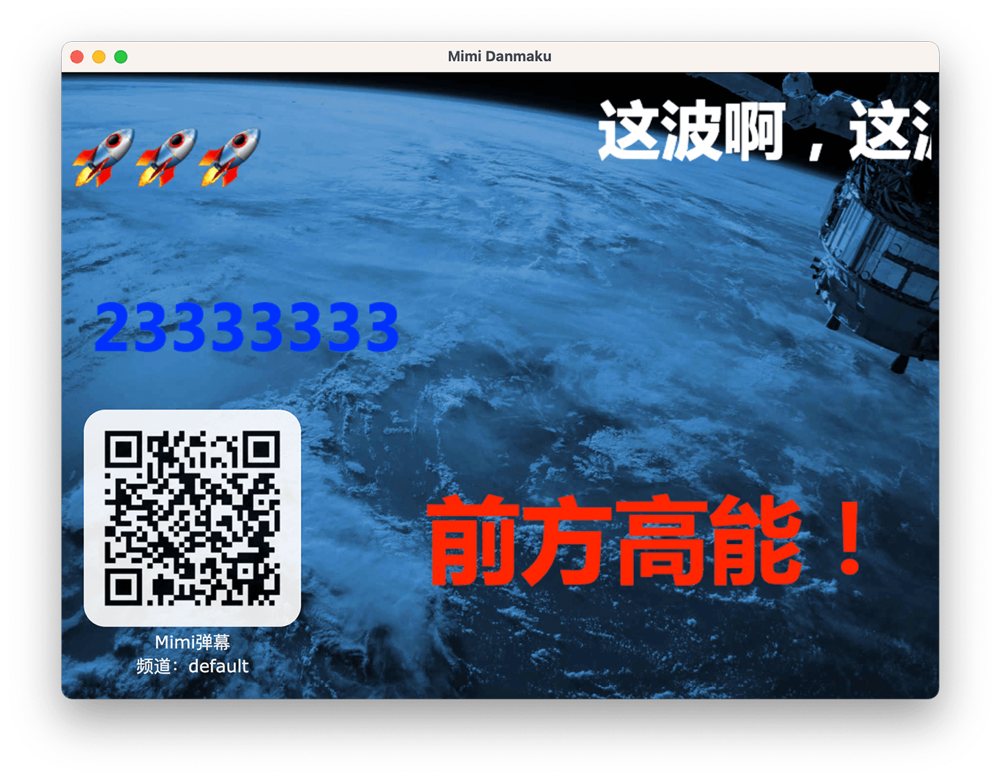

# Mimi Danmaku Client

基于 Node.js 和 Electron 构建的 Websocket 弹幕客户端。服务端见 [mimi-chat](https://github.com/stevenjoezhang/mimi-chat)。  
A Websocket danmaku client based on Node.js and Electron.



## To Use

To clone and run this repository you'll need [Git](https://git-scm.com) and [Node.js](https://nodejs.org/en/download) (which comes with [npm](http://npmjs.com)) installed on your computer.

Set up a mirror of electron before installation if necessary:
```bash
export ELECTRON_MIRROR="https://cdn.npm.taobao.org/dist/electron/" # *NIX command line
set ELECTRON_MIRROR=https://cdn.npm.taobao.org/dist/electron/ # Windows CMD
```

From your command line:
```bash
# Clone this repository
git clone https://github.com/stevenjoezhang/mimi-danmaku.git
# Go into the repository
cd mimi-danmaku
# Install dependencies
npm install
# Run the app
npm start
```

## Build

Use the following command to package it as a desktop app:
```bash
npm run build
```

## Credits

* [Mimi](https://zhangshuqiao.org) Developer of this project.
* Inspired by https://github.com/zsxsoft/danmu-client

## License

Released under the GNU General Public License v3  
http://www.gnu.org/licenses/gpl-3.0.html

## Todo List

- [ ] 屏蔽指定用户
- [ ] 支持正则屏蔽
- [x] 支持投影屏幕（[electron/screen.md](https://github.com/electron/electron/blob/master/docs/api/screen.md)）
- [ ] 允许选择字体
